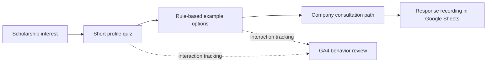

# Scholarship Exploration: From Student Questions to Consultation

**A quiz-style web prototype that uses scholarship interest as an entry point to study consultation.** I developed the concept after conversations with students during school-visit briefings in Mongolia highlighted the importance of affordability and scholarships.

**Public entry points:** [UNIE homepage](https://unie.kr/) · [linked prototype](http://unie-test-kiro.s3-website-us-west-2.amazonaws.com/). [Back to profile](../README.md).

## Problem and my role

The conversations in Mongolia led me to focus on a short scholarship-oriented quiz that could attract interest, offer example options, and connect the student with the company's consultation path. This was a qualitative product observation from conversations, rather than a statistical survey.

I turned that observation into the concept, designed and implemented the prototype, and connected the result flow to company consultation. I set up student-response recording in Google Sheets for follow-up and used GA4 behavior tracking to examine interest and drop-off within the page.

No individual student's information or conversation is included here.

## Implementation flow

| Area | Implementation scope |
| --- | --- |
| Frontend | React, Vite, and Tailwind CSS |
| Hosting | Static frontend build hosted on Amazon S3 |
| Quiz | Study/language profile inputs and required-value checks |
| Example suggestions | Hardcoded language-track and score rules, followed by selection of two or three examples from predefined candidate sets |
| Consultation | A path from the results to student contact and follow-up |
| Data and measurement | Google Sheets response integration and GA4 interaction-tracking code; the source also contains a Firestore lead-write path |

S3 hosts the frontend. Lead collection and analytics have their own integrations, so the implementation includes both hosting and integration scope.

## What the results mean

The displayed university and scholarship examples help start a consultation. The prototype does not calculate an admission probability, rank applicants using a validated model, or determine an awarded scholarship. Final admission and scholarship decisions belong to the universities.

The rules and example values are prototype content. They require verification against current university policies before being used as authoritative eligibility advice.

## Review path and verification

The public UNIE site links to the prototype. Its implementation and static deployment artifacts were inspected without submitting personal information or testing the live data destinations.

That inspection supports the React/Vite/Tailwind frontend, S3 hosting, rule-based examples, consultation flow, and presence of integration code. My product motivation, work responsibility, Sheets follow-up intent, and GA4 review intent are based on my confirmed account of the work.

Current form delivery and analytics operation were not independently tested for this documentation review. No conversion rate, active-user count, admission result, scholarship outcome, or measured uplift is asserted.

## Disclosure scope

This case study presents the company context, public interface, functionality, and my role. It includes no company source bundle, internal configuration, operational webhook/analytics identifiers, or individual student data.
