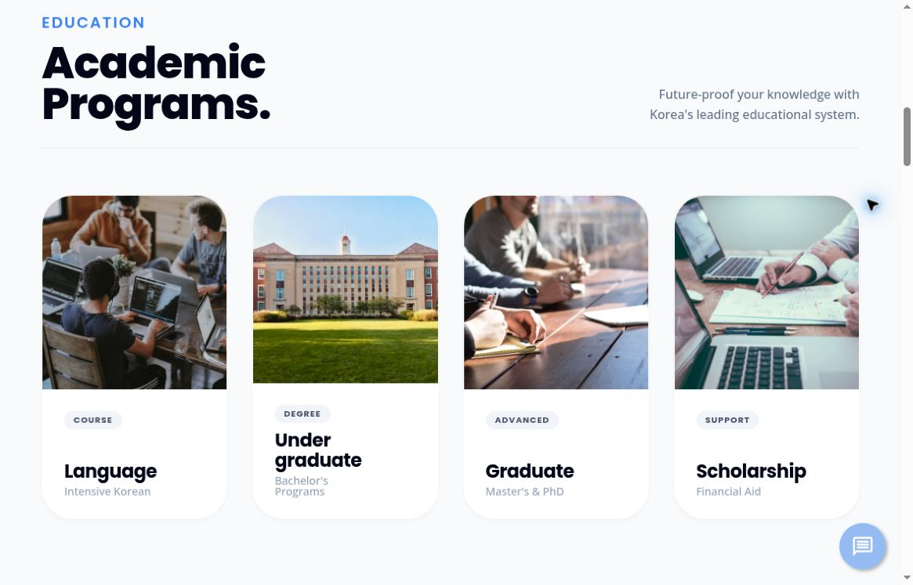
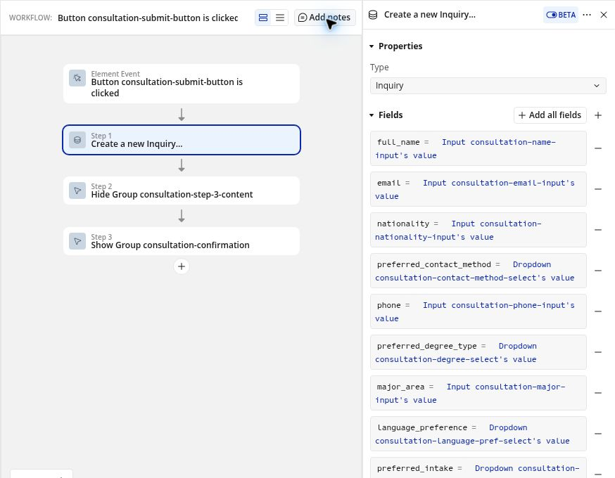

# UNIE: International Education Website

**A Bubble website with custom HTML/CSS, connecting international students with study information and consultation paths.** I handled the homepage design and implementation, with requirements and direction discussed alongside the planning team.

**Public interface:** [UNIE homepage](https://unie.kr/) · [FAQ](https://unie.kr/faq). [Back to profile](../README.md).

## Problem and my role

Students exploring study in Korea need a clear route between program information, scholarship questions, and a conversation with the team. The homepage brings these entry points into one navigation structure.

I discussed the plan and requirements with the planning team in meetings, then took responsibility for the homepage's visual design and implementation in Bubble. The public information and consultation entry points form the website's reviewable scope.

## Public implementation scope

| Area | What visitors can inspect |
| --- | --- |
| Study navigation | Language study, undergraduate study, graduate study, and scholarship categories |
| Other information routes | Mobility and collaboration sections |
| Consultation path | Calls to action that connect study information with consultation |
| Partner context | Public partner information and listings |
| FAQ | A separate page with expandable questions and answers |
| Scholarship entry | A link to the separate [scholarship exploration prototype](scholarship-tool.md) |

**Platform:** Bubble with custom HTML/CSS for the program-card interface. A separate React prototype is documented in the linked scholarship case study.

## Selected implementation evidence

### Public program navigation

*Public homepage captured during the October 2026 review. This is the current interface, not a historical before-and-after comparison.*

The program-card element inspected in the development copy contains custom HTML/CSS, including four-column academic and three-column mobility grids, card/image hover effects, and responsive rules at 1024px and 600px. The [selected CSS excerpt](snippets/program-card-responsive-excerpt.css) shows these layout rules; it is not a complete runnable page or an export of the application.

### Consultation workflow and data structure

*Selected configuration from `UNIE.KR(DEV_Jaeuk)`, inspected read-only in October 2026. It shows development-copy configuration, not proof of the current production submission flow.*

The selected button workflow creates an `Inquiry`, hides the input stage, and shows a confirmation group. The inspected development page has 27 configured workflows. The program data structure relates `Program` to `University` and includes program name/type, tuition, language, scholarship information, and an official application link. These observations describe configuration and field structure; no individual student submissions or data records were inspected.

## Review path and status

Open the homepage, follow its study and scholarship categories, and compare the FAQ and consultation entry points. These public surfaces provide a review path for the information architecture and interface.

The public homepage and FAQ were read during the documentation review. A later read-only review of the development copy provided the selected workflow screenshot and CSS excerpt above. No form submission, customer account, or backend operation was exercised.

## Evidence and boundaries

The interface descriptions come from the two public pages and the selected development-copy evidence. My role is based on my confirmed account of the work: the planning team joined the planning discussions, and I handled the design and implementation.

The two screenshots and CSS excerpt were selected and approved for public review. Full application exports, operational settings, and individual student data are excluded. This review does not establish production end-to-end behavior or a current security audit, and it does not assert a measured conversion improvement, traffic figure, or employment date.
